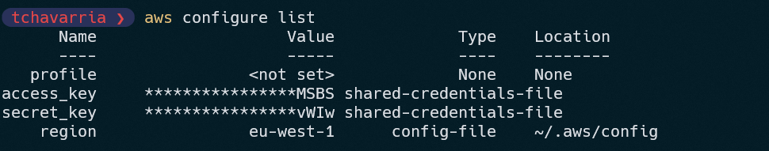
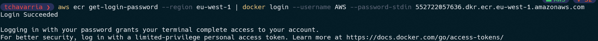
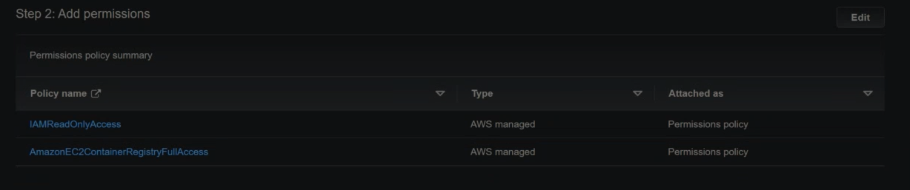

# AWS Lambda Container

Create a Docker image from an AWS base image for lambda (Python 3.8 example).

## Setup

### Install and configure AWS CLI 

Follow this instructions from the official AWS documentation:

1. [Installing or updating the latest version of the AWS CLI](https://docs.aws.amazon.com/cli/latest/userguide/getting-started-install.html)
2. [Configuration basics](https://docs.aws.amazon.com/cli/latest/userguide/cli-configure-quickstart.html)

   

### Test Docker

1. Start Docker
2. Authenticate the Docker CLI to your Amazon ECR registry.

   Modify the \<text\> arguments.

   ```sh
   aws ecr get-login-password --region <us-east-1> | docker login --username AWS --password-stdin <123456789012>.dkr.ecr.<us-east-1>.amazonaws.com    
   ```



## Create and push the image into ECR

### **Docker locally**

 1. Create a folder *aws_container_lambda*
 2. Create a subfolder *app*
 3. Create a Dockerfile inside *app/Dockerfile* (This is new *ENV AWS_REGION="eu-west-1"*)
    ```Docker
    FROM public.ecr.aws/lambda/python:3.8

    # Copy function code
    COPY app.py ${LAMBDA_TASK_ROOT}

    # Set an AWS_REGION environment variable
    ENV AWS_REGION="eu-west-1"

    # Install the function's dependencies using file requirements.txt
    # from your project folder.

    COPY requirements.txt  .
    RUN  pip3 install -r requirements.txt --target "${LAMBDA_TASK_ROOT}"

    # Set the CMD to your handler (could also be done as a parameter override outside of the Dockerfile)
    CMD [ "app.handler" ] 
    ``` 
 4. Create the python script *app/app.py*

    ```python
    import os
    import json
          
    def lambda_handler(event, context):
       json_region = os.environ['AWS_REGION']
       return {
          "statusCode": 200,
          "headers": {
                "Content-Type": "application/json"
          },
          "body": json.dumps({
                "Region ": json_region
          })
       }


    ```

5. Buils and test the image
   ```sh
   docker build -t <image-name> .   
   ```
6. Start the Docker image
   ```sh
   docker run -p 9000:8080 hello-world 
   ```
7. Test the app locally (*optional*)
   ```sh
   curl -XPOST "http://localhost:9000/2015-03-31/functions/function/invocations" -d '{}'
   ```


8. Create a private repository in *Amazon Container repository*, two options:
   - Using AWS CLI (computer) 
      ```sh
      aws ecr create-repository --repository-name <repo-name> --image-scanning-configuration scanOnPush=true --image-tag-mutability MUTABLE
      ```
   - Using AWS console (Browser) 
     - Look for the Amazon Elastic Container Registry service and create the container.
9. Push the image to this repository.
   
   Tag your image to match your repository name, and deploy the image to Amazon ECR using the docker push command.


   1. First tag the image
      ```sh
      docker tag  <image-name>:latest <user-id>.dkr.ecr.<region-name>.amazonaws.com/<repo-name>:latest        
      ```
   2. Push it
 
      ```sh
      docker push <user-id>.dkr.ecr.<region-name>.amazonaws.com/<repo-name>:latest
      ``` 
10. Check the repository in the AWS console.

This step could take a long time depending on the size of the image and your internet connection.

It's better to use an EC2 instance


### **Docker on EC2**

1. Create an EC2 instance 
   1. Ubuntu 20.04
   2. t2 free tier
   3. Memory: 8GB RAM, 16GB SSD
   4. Create a new IAM role
      - Trusted entity type: AWS service
      - Use case: EC2
      - Permissions policies:
         - AmazonEC2ContainerRegistryFullAccess
         - IAMReadOnlyAccess 
  
         


   5. Edit the user data to install *Docker* AND *awscli* in the instance *(this is my script, which is different from the one used in class)*:
 
      ```sh
      #!/bin/bash
      sudo apt-get update
      sudo apt-get install
      #Docker installation
      sudo apt-get install apt-transport-https ca-certificates curl software-properties-common -y
      curl -fsSL https://download.docker.com/linux/ubuntu/gpg | sudo apt-key add -
      curl -fsSL https://download.docker.com/linux/ubuntu/gpg | sudo apt-key add -
      sudo add-apt-repository "deb [arch=amd64] https://download.docker.com/linux/ubuntu  $(lsb_release -cs)  stable"
      sudo apt update
      sudo apt-get install -y docker-ce 
      docker --version
      sudo systemctl start docker
      ## Install AWSCLI
      sudo apt-get install -y awscli

      ```
2. Launch it!
3. Build the Docker image 
    
   ```sh
   sudo docker build -t <image-name> https://github.com/tobias-chc/aws_lambda_container.git#main:app
   ``` 
4. Authenticate the Docker CLI to your Amazon ECR registry. (Correct the parameters)
   ```sh
   sudo su
   ```

   ```sh
   aws ecr get-login-password --region <region-name> | docker login --username AWS --password-stdin <user-id>.dkr.ecr.<region-name>.amazonaws.com    

   ```

5. Repeat steps 8, 9, 10 of the section above.


### References

- https://docs.aws.amazon.com/lambda/latest/dg/images-create.html
- https://docs.aws.amazon.com/cli/latest/userguide/getting-started-install.html
- https://docs.aws.amazon.com/cli/latest/userguide/cli-configure-quickstart.html
  

**Author:** [Tobías Chavarría](https://github.com/tobias-chc)
